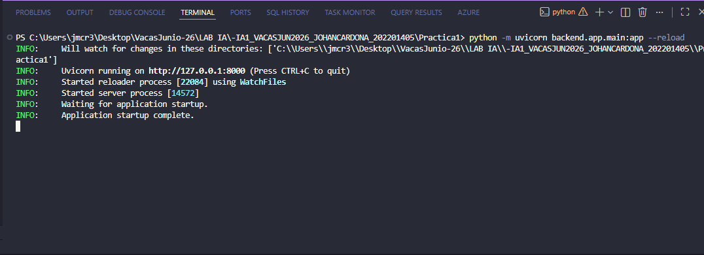
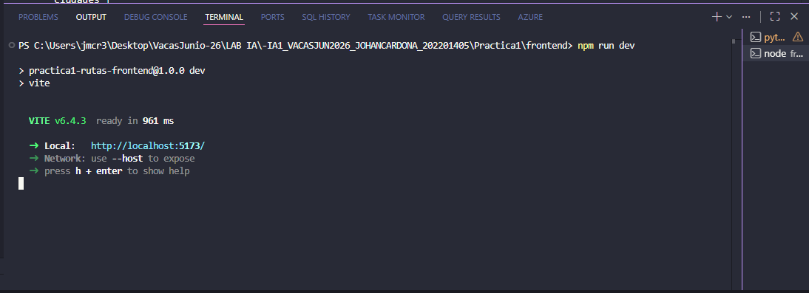
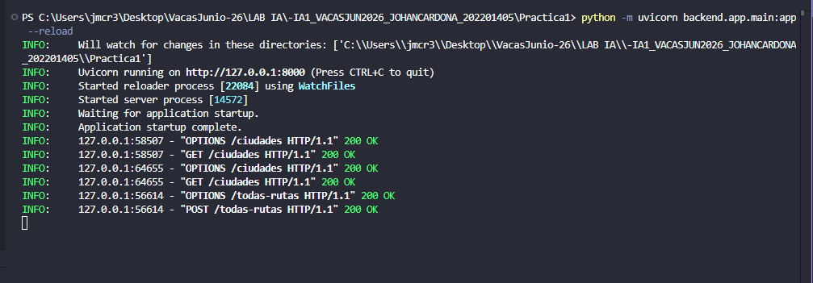
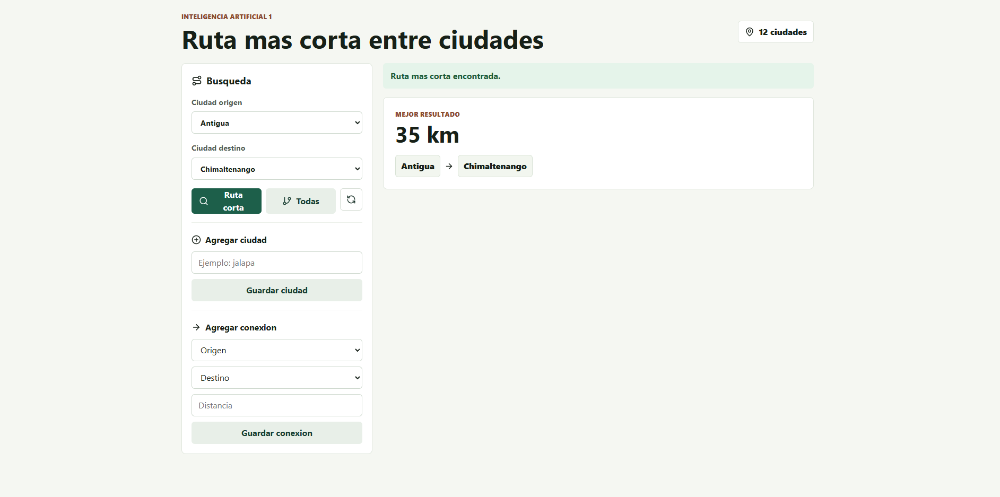
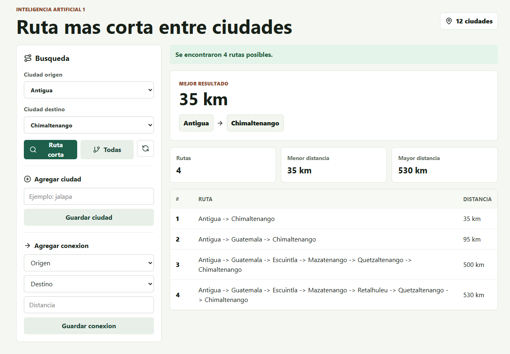
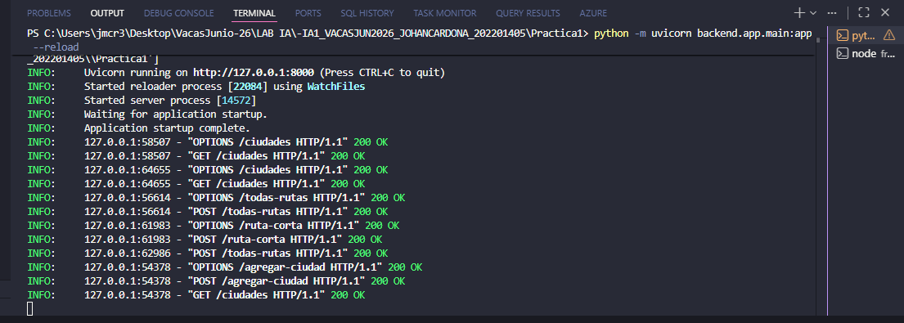
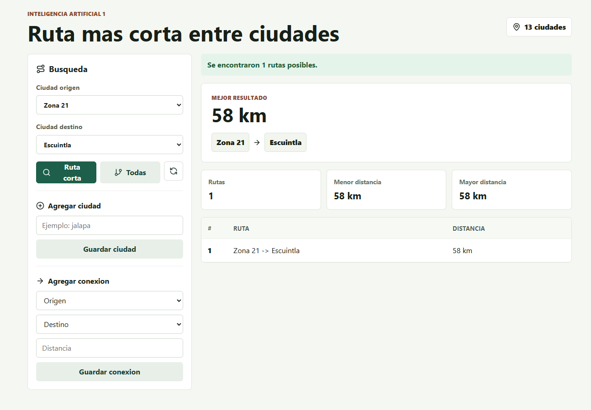

# Manual de Usuario

## Practica 1 - Ruta mas corta entre ciudades


Johan Moises Cardona Rosales - 202201405

## 1. Introduccion

Este manual explica la instalacion, ejecucion y uso del sistema de busqueda de rutas entre ciudades. La aplicacion permite consultar la ruta mas corta, visualizar todas las rutas posibles, agregar nuevas ciudades y agregar conexiones con distancia.

El sistema esta compuesto por un frontend web, un backend en Python y un motor logico en Prolog.

## 2. Requisitos previos

Antes de ejecutar el sistema se debe contar con:

- Python 3.11 o superior.
- SWI-Prolog instalado.
- Node.js instalado.
- npm instalado.
- Navegador web actualizado.
- Dependencias del backend instaladas.
- Dependencias del frontend instaladas.

## 3. Instalacion

### 3.1 Instalar dependencias del backend

Abrir una terminal en la carpeta principal del proyecto:

```powershell
cd "C:\Users\jmcr3\Desktop\VacasJunio-26\LAB IA\-IA1_VACASJUN2026_JOHANCARDONA_202201405\Practica1"
```

Ejecutar:

```powershell
pip install -r backend/requirements.txt
```

### 3.2 Instalar dependencias del frontend

Abrir una terminal en la carpeta del frontend:

```powershell
cd "C:\Users\jmcr3\Desktop\VacasJunio-26\LAB IA\-IA1_VACASJUN2026_JOHANCARDONA_202201405\Practica1\frontend"
```

Ejecutar:

```powershell
npm install
```

## 4. Ejecucion del sistema

### 4.1 Levantar backend

Desde la carpeta `Practica1`, ejecutar:

```powershell
python -m uvicorn backend.app.main:app --reload
```

El backend quedara disponible en:

```text
http://127.0.0.1:8000
```

La documentacion automatica de FastAPI se puede consultar en:

```text
http://127.0.0.1:8000/docs
```

**Captura sugerida:** `Evidencias/01_backend_ejecucion.png`



### 4.2 Levantar frontend

En otra terminal, desde la carpeta `Practica1/frontend`, ejecutar:

```powershell
npm run dev
```

El frontend quedara disponible en:

```text
http://127.0.0.1:5173/
```

**Captura sugerida:** `Evidencias/02_frontend_ejecucion.png`



## 5. Pantalla principal

Al ingresar a la aplicacion se muestra una interfaz con las siguientes secciones:

- Selector de ciudad origen.
- Selector de ciudad destino.
- Boton para consultar ruta corta.
- Boton para consultar todas las rutas.
- Formulario para agregar ciudad.
- Formulario para agregar conexion.
- Panel de resultados.

El contador superior muestra la cantidad de ciudades cargadas desde Prolog.

## 6. Consultar ciudades disponibles

El sistema obtiene las ciudades desde el backend, el cual consulta la base de conocimiento en Prolog.

Tambien puede verificarse desde el navegador ingresando a:

```text
http://127.0.0.1:8000/ciudades
```

**Captura sugerida:** `Evidencias/03_ciudades_backend.png`



## 7. Consultar ruta mas corta

Para consultar la ruta mas corta:

1. Seleccionar una ciudad en el campo `Ciudad origen`.
2. Seleccionar una ciudad diferente en el campo `Ciudad destino`.
3. Presionar el boton `Ruta corta`.
4. Revisar la ruta recomendada y la distancia total.

Ejemplo:

```text
Origen: Guatemala
Destino: Puerto Barrios
Resultado: Guatemala -> Zacapa -> Puerto Barrios
Distancia: 320 km
```

**Captura sugerida:** `Evidencias/04_ruta_mas_corta.png`



## 8. Consultar todas las rutas posibles

Para visualizar todas las rutas:

1. Seleccionar la ciudad origen.
2. Seleccionar la ciudad destino.
3. Presionar el boton `Todas`.
4. Revisar la tabla de resultados.

La tabla muestra:

- Numero de ruta.
- Recorrido completo.
- Distancia total.

Las rutas se presentan ordenadas de menor a mayor distancia.

**Captura sugerida:** `Evidencias/05_todas_las_rutas.png`



## 9. Agregar una ciudad

Para agregar una nueva ciudad:

1. Ubicar la seccion `Agregar ciudad`.
2. Escribir el nombre de la ciudad.
3. Presionar `Guardar ciudad`.
4. Verificar el mensaje de confirmacion.

Ejemplo:

```text
Nueva ciudad: jalapa
```

El sistema normaliza el texto antes de enviarlo a Prolog. Por ejemplo, `San Jose` se registra como `san_jose`.

**Captura sugerida:** `Evidencias/06_agregar_ciudad.png`



## 10. Agregar una conexion

Para agregar una conexion entre dos ciudades:

1. Ubicar la seccion `Agregar conexion`.
2. Seleccionar la ciudad origen.
3. Seleccionar la ciudad destino.
4. Ingresar una distancia mayor a cero.
5. Presionar `Guardar conexion`.
6. Verificar el mensaje de confirmacion.

Ejemplo:

```text
Origen: jalapa
Destino: guatemala
Distancia: 100
```

**Captura sugerida:** `Evidencias/07_agregar_conexion.png`



## 11. Mensajes y validaciones

El sistema muestra mensajes cuando:

- Se encuentra una ruta correctamente.
- Se agrega una ciudad correctamente.
- Se agrega una conexion correctamente.
- No existe una ruta disponible.
- Una ciudad ya existe.
- La conexion no se puede agregar.
- Falta completar algun campo obligatorio.
- La distancia ingresada no es valida.

## 12. Recomendaciones de uso

- Mantener abierto el backend mientras se usa el frontend.
- No cerrar la terminal de FastAPI durante las pruebas.
- No cerrar la terminal de Vite durante las pruebas.
- Usar nombres de ciudades claros y sin simbolos especiales.
- Verificar que el backend responda en `/ciudades` si la interfaz no carga datos.

## 13. Cierre del sistema

Para detener el sistema:

1. Ir a la terminal del frontend y presionar `Ctrl + C`.
2. Ir a la terminal del backend y presionar `Ctrl + C`.

Con esto se detienen ambos servicios locales.
