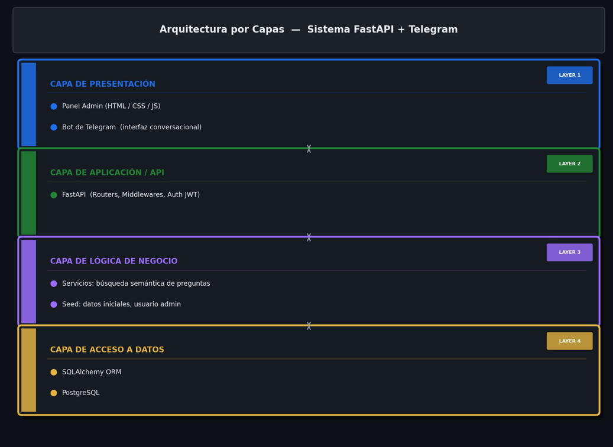
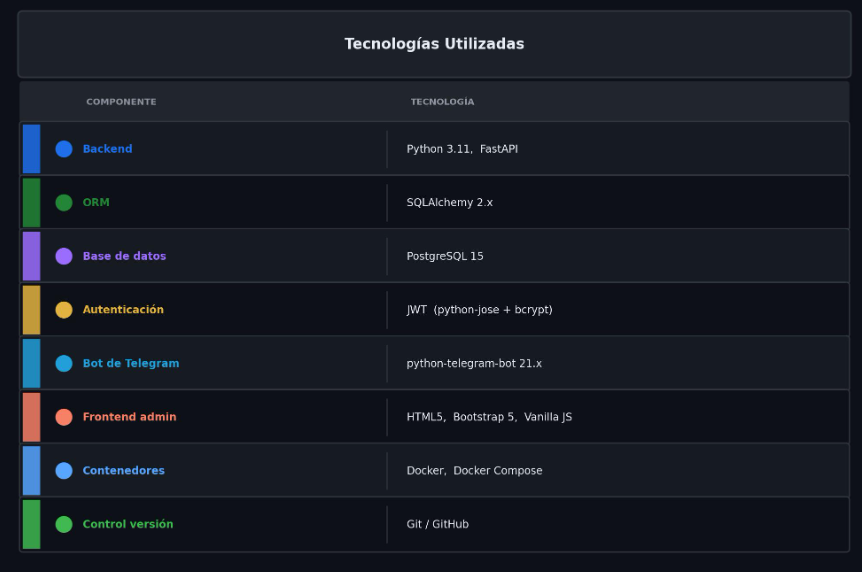
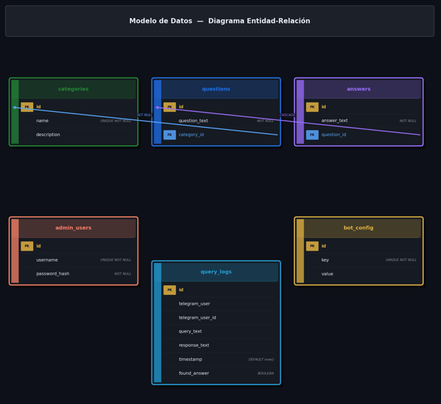

# Manual Técnico – SmartBot

**Práctica 2 – Inteligencia Artificial 1**  
Universidad de San Carlos de Guatemala – Facultad de Ingeniería  
Autor: Johan Cardona | Carné: 202201405

---

## 1. Descripción del sistema

SmartBot es un sistema de respuestas automatizadas basado en un bot de Telegram que responde consultas frecuentes utilizando información almacenada en una base de datos PostgreSQL. Cuenta con un panel administrativo web protegido con autenticación JWT para gestionar preguntas, respuestas y categorías.

---

## 2. Patrón de arquitectura utilizado

El sistema implementa una **arquitectura en capas (Layered Architecture / N-Tier)**:





---

## 3. Estructura del proyecto

```
Practica2/
├── backend/
│   ├── app/
│   │   ├── __init__.py
│   │   ├── main.py          # Entry point FastAPI
│   │   ├── database.py      # Conexión SQLAlchemy
│   │   ├── models.py        # Modelos ORM
│   │   ├── schemas.py       # Esquemas Pydantic
│   │   ├── auth.py          # JWT + hashing
│   │   ├── seed.py          # Datos iniciales
│   │   └── routers/
│   │       ├── auth_router.py
│   │       ├── categories.py
│   │       ├── questions.py
│   │       ├── answers.py
│   │       ├── config.py
│   │       ├── logs.py
│   │       ├── stats.py
│   │       └── bot_query.py
│   ├── static/
│   │   ├── css/style.css
│   │   └── js/app.js
│   ├── templates/
│   │   └── index.html
│   ├── requirements.txt
│   └── Dockerfile
├── bot/
│   ├── bot.py
│   ├── requirements.txt
│   └── Dockerfile
├── docker-compose.yml
├── .env.example
└── docs/
    ├── manual_tecnico.md
    └── manual_usuario.md
```

---

## 4. Tecnologías utilizadas


---

## 5. Modelo de datos (ER)



----

**Relaciones:**
- `categories` 1 ──── N `questions`
- `questions`  1 ──── N `answers`
- `query_logs`, `admin_users`, `bot_config` son independientes

---

## 6. API REST – Endpoints

### Autenticación
| Método | Endpoint           | Descripción            | Auth requerida |
|--------|--------------------|------------------------|----------------|
| POST   | `/api/auth/login`  | Login, retorna JWT     | No             |

### Categorías
| Método | Endpoint                   | Descripción          | Auth |
|--------|----------------------------|----------------------|------|
| GET    | `/api/categories/`         | Listar categorías    | No   |
| POST   | `/api/categories/`         | Crear categoría      | Sí   |
| GET    | `/api/categories/{id}`     | Obtener por ID       | No   |
| PUT    | `/api/categories/{id}`     | Actualizar           | Sí   |
| DELETE | `/api/categories/{id}`     | Eliminar             | Sí   |

### Preguntas
| Método | Endpoint                  | Descripción       | Auth |
|--------|---------------------------|-------------------|------|
| GET    | `/api/questions/`         | Listar preguntas  | No   |
| POST   | `/api/questions/`         | Crear pregunta    | Sí   |
| GET    | `/api/questions/{id}`     | Obtener por ID    | No   |
| PUT    | `/api/questions/{id}`     | Actualizar        | Sí   |
| DELETE | `/api/questions/{id}`     | Eliminar          | Sí   |

### Respuestas
| Método | Endpoint                | Descripción       | Auth |
|--------|-------------------------|-------------------|------|
| GET    | `/api/answers/`         | Listar respuestas | No   |
| POST   | `/api/answers/`         | Crear respuesta   | Sí   |
| GET    | `/api/answers/{id}`     | Obtener por ID    | No   |
| PUT    | `/api/answers/{id}`     | Actualizar        | Sí   |
| DELETE | `/api/answers/{id}`     | Eliminar          | Sí   |

### Configuración
| Método | Endpoint            | Descripción              | Auth |
|--------|---------------------|--------------------------|------|
| GET    | `/api/config/`      | Listar configuración     | Sí   |
| POST   | `/api/config/`      | Crear / actualizar clave | Sí   |
| GET    | `/api/config/{key}` | Obtener por clave        | No   |

### Bot
| Método | Endpoint          | Descripción                            | Auth |
|--------|-------------------|----------------------------------------|------|
| POST   | `/api/bot/query`  | Consulta del bot, retorna respuesta    | No   |

### Estadísticas y Logs
| Método | Endpoint       | Descripción               | Auth |
|--------|----------------|---------------------------|------|
| GET    | `/api/stats/`  | Estadísticas del sistema  | Sí   |
| GET    | `/api/logs/`   | Historial de consultas    | Sí   |

Documentación interactiva Swagger disponible en: `http://localhost:8000/api/docs`

---

## 7. Algoritmo de búsqueda de respuestas

El endpoint `/api/bot/query` implementa un algoritmo de coincidencia semántica basado en:

1. **Coincidencia exacta / subcadena**: si el texto del usuario está contenido en la pregunta o viceversa → score 0.85
2. **Solapamiento de palabras** (excluyendo stop words en español) → score ponderado × 0.75
3. **SequenceMatcher** (difflib) para similitud de cadenas → score ponderado × 0.55
4. Se selecciona la pregunta con mayor score; si supera el umbral (0.25) se devuelve su respuesta.

---

## 8. Configuración de Docker Compose

El archivo `docker-compose.yml` define tres servicios:

- **db**: PostgreSQL 15 con healthcheck que espera a que la base de datos esté lista.
- **backend**: FastAPI sobre uvicorn en el puerto 8000. Depende de `db` (healthcheck).
- **bot**: Bot de Telegram. Depende de `backend` e incluye lógica de reintentos para esperar que el backend esté disponible.

---

## 9. Requerimientos funcionales

| RF  | Descripción |
|-----|-------------|
| RF1 | El sistema permite registrar preguntas frecuentes con categoría |
| RF2 | El sistema permite registrar respuestas asociadas a preguntas |
| RF3 | El administrador puede crear, leer, actualizar y eliminar categorías |
| RF4 | El administrador puede crear, leer, actualizar y eliminar preguntas |
| RF5 | El administrador puede crear, leer, actualizar y eliminar respuestas |
| RF6 | El panel administrativo requiere autenticación con usuario y contraseña |
| RF7 | El bot de Telegram recibe mensajes y retorna la respuesta más relevante |
| RF8 | El sistema registra todas las consultas realizadas al bot |
| RF9 | El administrador puede configurar el Chat ID de Telegram desde el panel |
| RF10| El sistema muestra estadísticas de uso en el dashboard |
| RF11| Si no existe respuesta para una consulta, el bot lo indica al usuario |

---

## 10. Requerimientos no funcionales

| RNF  | Categoría       | Descripción |
|------|-----------------|-------------|
| RNF1 | Seguridad       | Las contraseñas se almacenan con hash bcrypt |
| RNF2 | Seguridad       | El acceso a la API administrativa requiere token JWT con expiración de 24h |
| RNF3 | Seguridad       | Las rutas de modificación de datos requieren autenticación |
| RNF4 | Rendimiento     | Las consultas del bot obtienen respuesta en menos de 2 segundos |
| RNF5 | Disponibilidad  | Los servicios se reinician automáticamente si fallan (restart: unless-stopped) |
| RNF6 | Mantenibilidad  | El código sigue el patrón de arquitectura en capas con separación de responsabilidades |
| RNF7 | Portabilidad    | El sistema se ejecuta en cualquier plataforma mediante Docker Compose |
| RNF8 | Usabilidad      | El panel administrativo es accesible desde cualquier navegador moderno |
| RNF9 | Escalabilidad   | La arquitectura permite agregar nuevas categorías y preguntas sin modificar el código |

---

## 11. Posibles mejoras futuras

- Implementar NLP (procesamiento de lenguaje natural) para mejorar la precisión de búsqueda.
- Agregar soporte para múltiples idiomas.
- Implementar autenticación por OAuth2.
- Añadir caché (Redis) para respuestas frecuentes.
- Implementar paginación en los endpoints de lista.
- Panel de análisis de sentimiento en los logs.
