# SmartInvoice - Manual de Usuario

**Universidad de San Carlos de Guatemala**
**Facultad de Ingenieria - Escuela de Ciencias y Sistemas**
**Inteligencia Artificial 1 - Seccion A - Vacaciones Junio 2026**

| Campo | Detalle |
|---|---|
| Estudiante | Johan Moises Cardona Rosales |
| Carne | 202201405 |
| Catedratico | M.S.c Luis Fernando Espino Barrios |
| Auxiliar | Roberto Miguel Garcia Santizo |
| Fecha | Junio 2026 |

---

## Introduccion

SmartInvoice es un sistema web que procesa facturas de forma inteligente. El usuario sube una factura en formato PDF, JPG o PNG, y el sistema extrae automaticamente los datos relevantes mediante OCR: numero de factura, fecha, nombre del proveedor, NIT, subtotal, impuestos y total.

El sistema tambien permite gestionar un catalogo de proveedores, consultar el historial de procesamiento, generar reportes en PDF, Excel o CSV, y enviarlos por correo electronico.

**Requisito previo:** Tener el servidor corriendo en `http://localhost:8000`

---

## 1. Inicio de Sesion

Al abrir el navegador en `http://localhost:8000`, se muestra la pantalla de inicio de sesion.

**Pasos:**

1. Ingresar el correo electronico en el campo **Email**
2. Ingresar la contrasena en el campo **Contrasena**
3. Hacer clic en el boton **Ingresar**
4. Si las credenciales son correctas, el sistema redirige al Panel Principal

**Credenciales por defecto:**

```
Email:     admin@smartinvoice.com
Contrasena: admin123
```

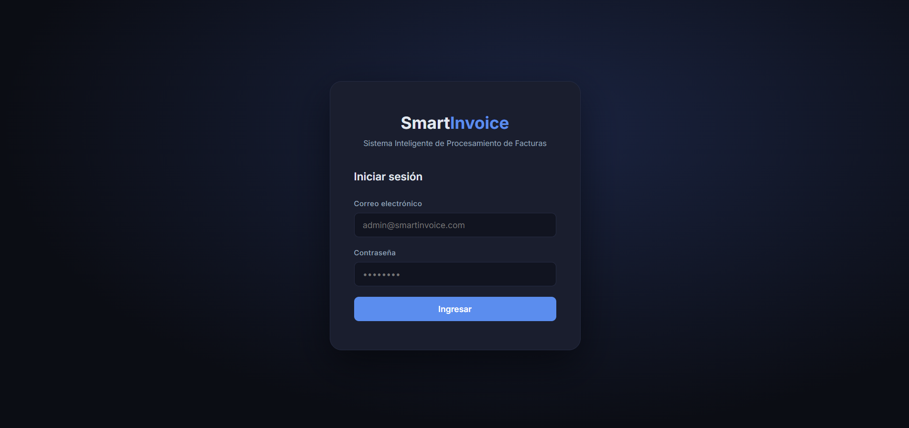

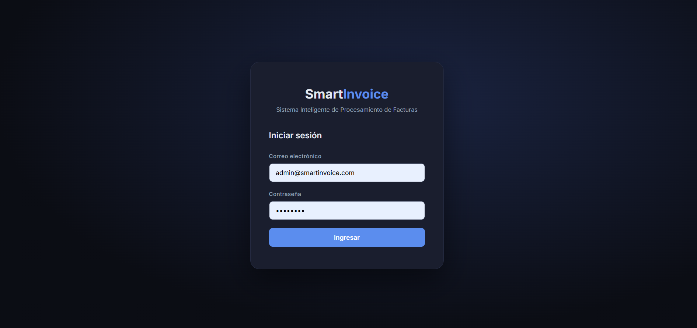

> Si se ingresa un correo o contrasena incorrectos, el sistema muestra el mensaje "Credenciales invalidas" sin especificar cual es el campo incorrecto (por seguridad).


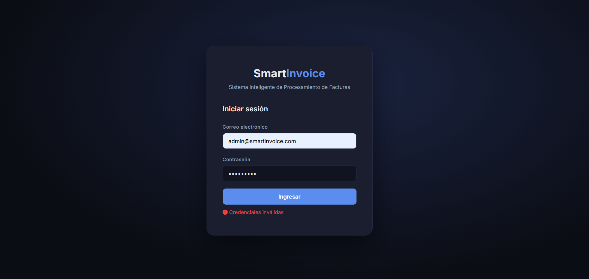

---

## 2. Panel Principal

El panel principal muestra un resumen del estado del sistema con cuatro tarjetas de estadisticas:

| Tarjeta | Descripcion |
|---|---|
| Total Facturas | Cantidad total de facturas cargadas en el sistema |
| Procesadas | Facturas con extraccion OCR exitosa y datos validados |
| Pendientes | Facturas en espera de ser procesadas |
| Con Error | Facturas rechazadas o con fallo en el procesamiento |

Ademas se muestra:

- **Actividad Reciente:** Las 6 ultimas facturas cargadas con su estado y total
- **Monto Total:** Suma acumulada de todas las facturas con estado "Procesado"
- Boton **Generar Reporte** que lleva directo a la seccion de Reportes


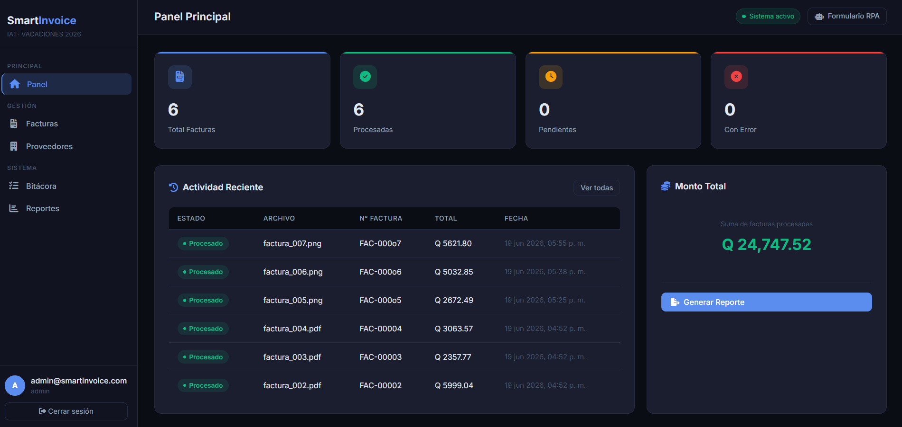

---

## 3. Gestion de Facturas

Hacer clic en **Facturas** en el menu lateral izquierdo.

### 3.1 Cargar una Factura

1. En la seccion **Cargar Factura**, hacer clic en la zona de carga o arrastrar el archivo directamente sobre ella
2. Seleccionar un archivo en formato **PDF, JPG, JPEG o PNG**
3. El sistema muestra una barra de progreso mientras sube el archivo
4. Al completarse aparece el mensaje: *"Factura #X cargada. Procesando con OCR..."*
5. El sistema procesa la factura en segundo plano. La tabla se actualiza automaticamente en unos segundos con los datos extraidos

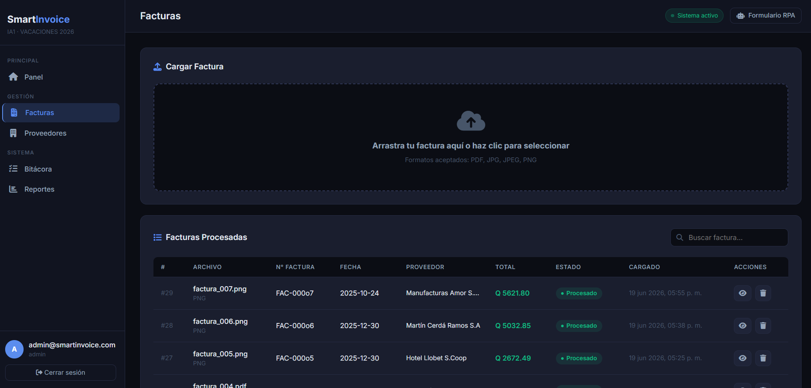

> El procesamiento OCR puede tardar entre 10 y 40 segundos segun el tamano y complejidad del documento.

### 3.2 Estados de una Factura

| Estado | Descripcion |
|---|---|
| **Pendiente** | La factura fue cargada pero el OCR aun no termino de procesarla |
| **Procesado** | El OCR extrajo los datos correctamente y superaron la validacion automatica |
| **Rechazado** | El OCR funciono pero los datos no pasaron la validacion (inconsistencia numerica o sin numero de factura) |
| **Error** | Ocurrio un fallo tecnico durante el procesamiento del documento |

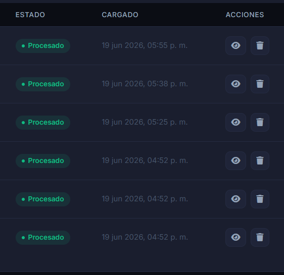

### 3.3 Ver Detalle de una Factura

1. En la tabla de facturas, hacer clic en el **icono de ojo** de la fila deseada
2. Se abre un panel modal con todos los campos extraidos:
   - Nombre del archivo y tipo
   - Numero de factura
   - Fecha de la factura
   - Nombre del proveedor (detectado por OCR)
   - Subtotal, Impuestos y Total
   - Porcentaje de confianza del OCR
   - Estado actual
3. En la parte inferior del modal se muestra el **texto crudo extraido por el OCR**, util para verificar que el documento fue leido correctamente


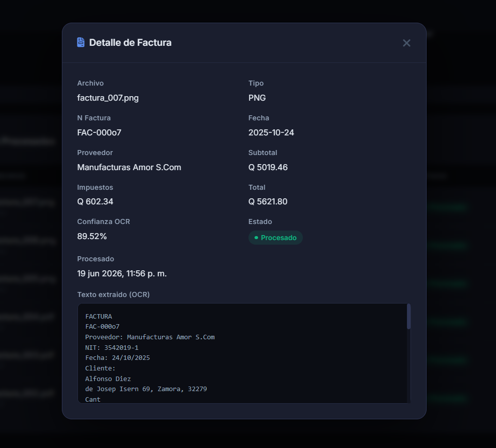

### 3.4 Buscar Facturas

La barra de busqueda en la parte superior de la tabla filtra en tiempo real por:

- Nombre del archivo
- Numero de factura
- Estado (Procesado, Pendiente, Error, Rechazado)

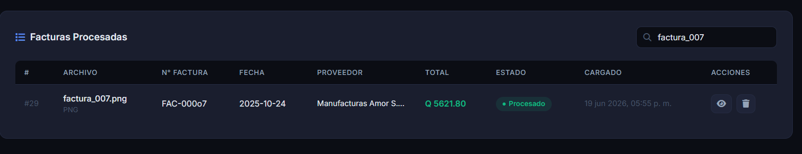

### 3.5 Eliminar una Factura

1. Hacer clic en el **icono de papelera** en la fila de la factura
2. Confirmar la accion en el dialogo de confirmacion

> La eliminacion es permanente. El registro y todos sus datos extraidos seran borrados de la base de datos.


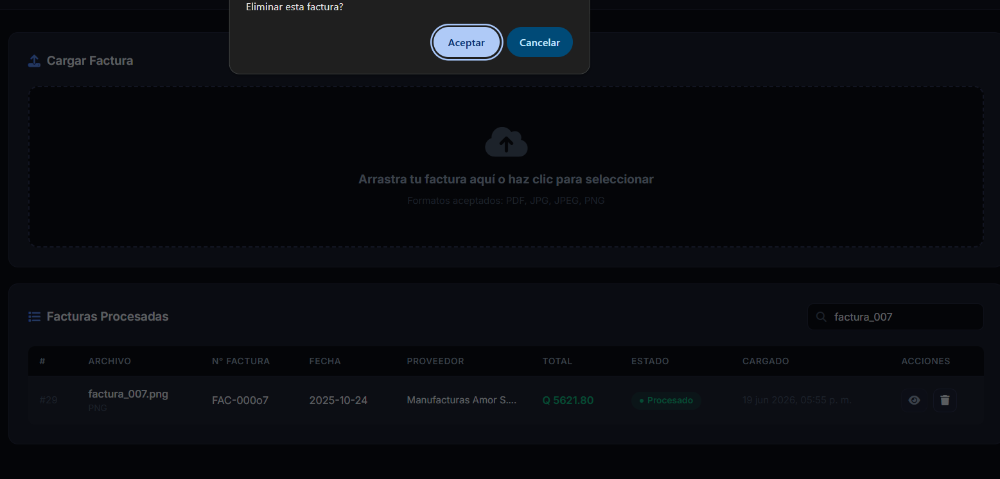

---

## 4. Gestion de Proveedores

Hacer clic en **Proveedores** en el menu lateral izquierdo.

Al registrar un proveedor con su NIT, el sistema vinculara automaticamente las proximas facturas que contengan ese NIT al procesarlas con OCR.

### 4.1 Registrar un Nuevo Proveedor

1. Hacer clic en el boton **+ Nuevo** en la parte superior derecha
2. Completar el formulario:

| Campo | Obligatorio | Descripcion |
|---|---|---|
| Nombre | Si | Razon social o nombre comercial |
| NIT | Si | Numero de Identificacion Tributaria (debe ser unico) |
| Email | No | Correo electronico de contacto |
| Telefono | No | Numero de telefono |
| Direccion | No | Direccion fiscal del proveedor |

3. Hacer clic en **Guardar**

> Una vez registrado el proveedor, las proximas facturas que contengan su NIT seran vinculadas automaticamente al procesarlas.


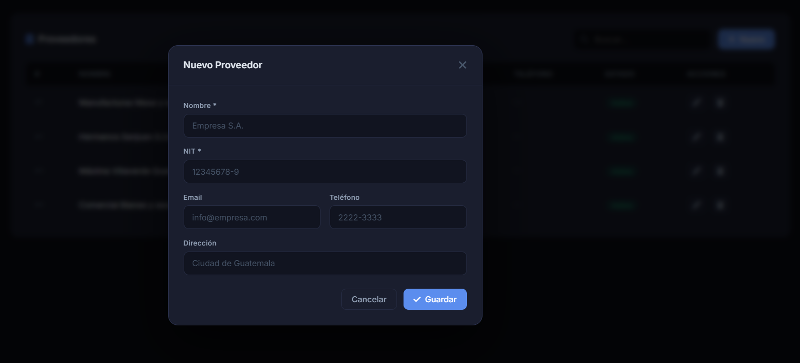

### 4.2 Editar un Proveedor

1. Hacer clic en el **icono de lapiz** en la fila del proveedor
2. Modificar los campos deseados
3. Hacer clic en **Guardar** para confirmar los cambios

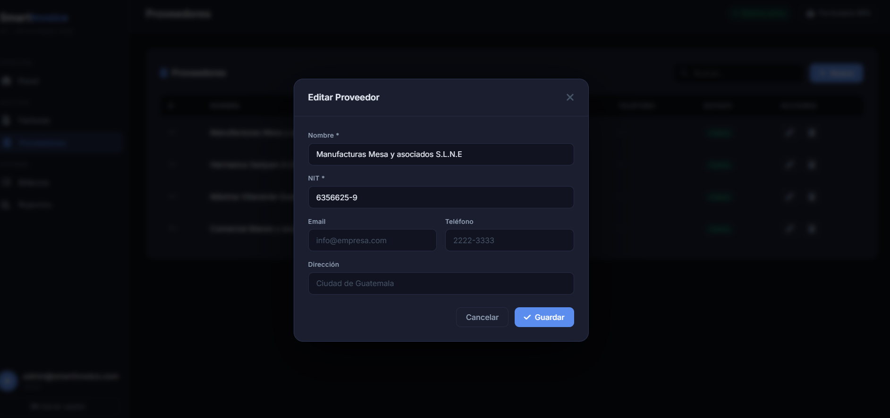


### 4.3 Desactivar un Proveedor

Al hacer clic en el **icono de papelera** de un proveedor, este se **desactiva** (baja logica). No se elimina de la base de datos para preservar el historial de facturas que ya lo referencian. Los proveedores desactivados no aparecen en la lista.

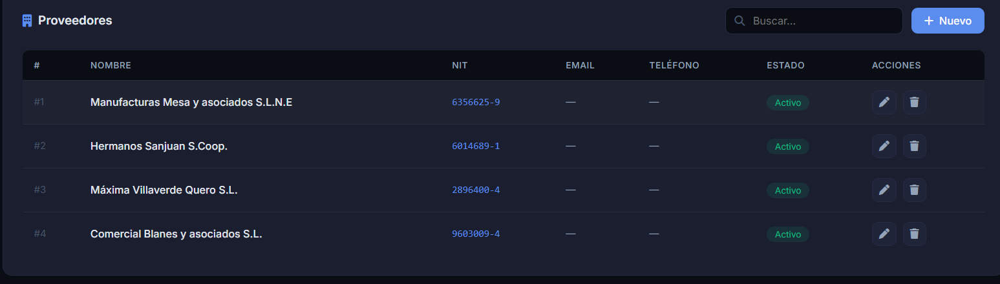


### 4.4 Buscar Proveedores

La barra de busqueda filtra en tiempo real por **nombre** o por **NIT** del proveedor.

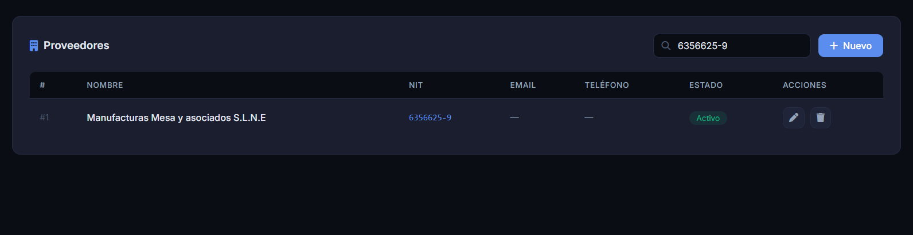

---

## 5. Bitacora de Actividad

Hacer clic en **Bitacora** en el menu lateral izquierdo.

La bitacora registra automaticamente cada accion relevante del sistema. No requiere ninguna interaccion del usuario para generar registros.


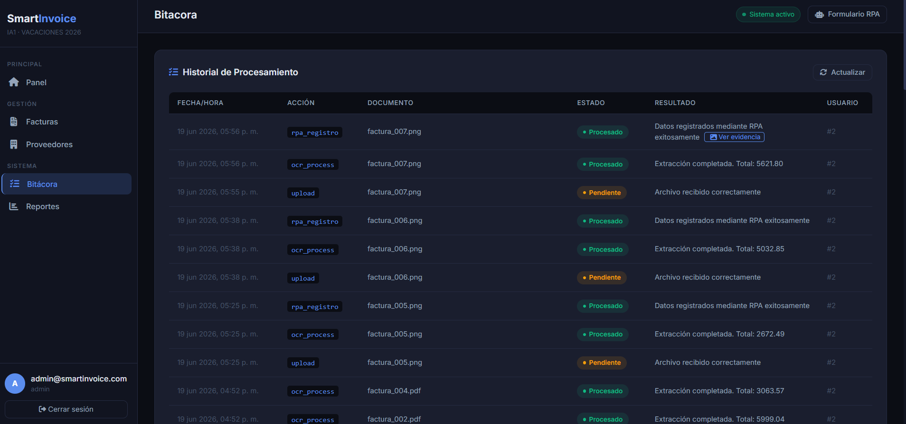

### 5.1 Tipos de Acciones Registradas

| Accion | Descripcion |
|---|---|
| `upload` | El usuario subio un archivo de factura al sistema |
| `ocr_process` | El motor OCR proceso la factura. El campo Resultado muestra el total detectado o el motivo de rechazo |
| `rpa_registro` | Playwright lleno automaticamente el formulario RPA. Muestra el enlace "Ver evidencia" con el screenshot |

### 5.2 Ver Evidencia RPA

Para las filas con accion `rpa_registro`, aparece el enlace **Ver evidencia** en la columna Resultado:

1. Ir a la seccion **Bitacora**
2. Buscar la fila con accion `rpa_registro`
3. Hacer clic en **Ver evidencia**
4. Se abre en una nueva pestana el screenshot del formulario RPA con todos los campos llenos automaticamente


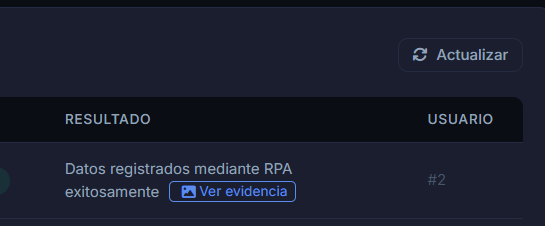

> Hacer clic en **Actualizar** para recargar la bitacora con los eventos mas recientes.

---

## 6. Reportes y Correos

Hacer clic en **Reportes** en el menu lateral izquierdo.

### 6.1 Generar un Reporte

1. Seleccionar el formato haciendo clic en una de las tres opciones:

| Formato | Descripcion |
|---|---|
| **PDF** | Documento con tabla estilizada, encabezado y colores alternados |
| **Excel** | Hoja de calculo compatible con Microsoft Excel y LibreOffice |
| **CSV** | Archivo de texto con valores separados por comas |

2. (Opcional) Escribir una direccion de correo en el campo **Enviar por email** para recibir el reporte como adjunto
3. Hacer clic en **Generar Reporte**
4. El sistema genera el reporte en segundo plano. Despues de unos segundos aparece en la tabla **Reportes Generados**


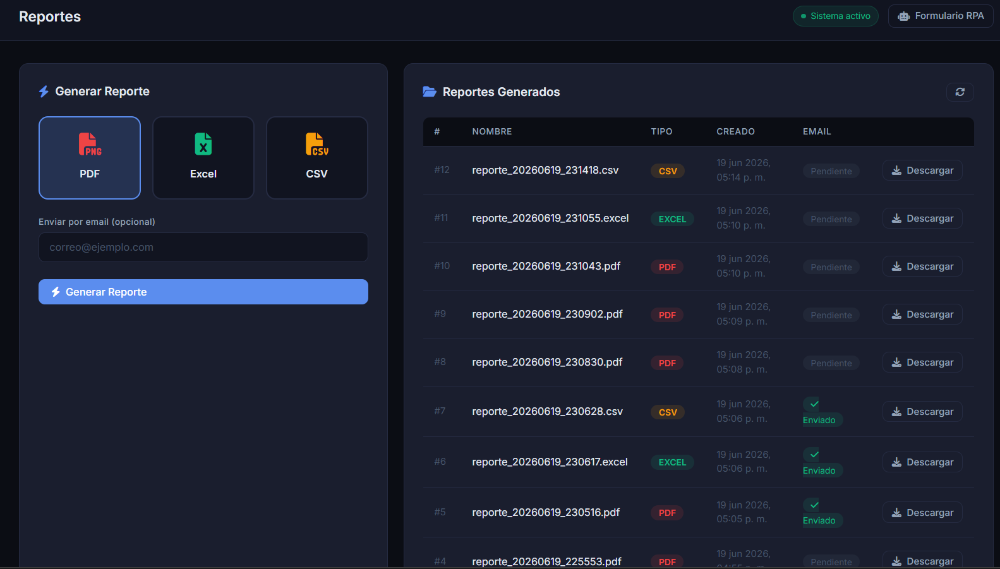

### 6.2 Descargar un Reporte

1. En la tabla de Reportes Generados, localizar el reporte deseado
2. Hacer clic en el boton **Descargar**
3. El archivo se descarga automaticamente al equipo

### 6.3 Estado del Envio por Email

La columna **Email** indica si el reporte fue enviado:

- **Enviado:** El reporte fue enviado correctamente al correo indicado
- **Pendiente:** No se solicito envio por correo, o el envio no fue exitoso


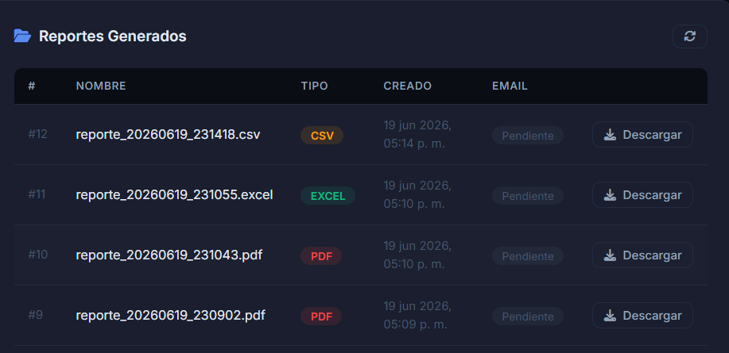

---

## 7. Formulario RPA

El **Formulario RPA** es la pagina objetivo del proceso de automatizacion. El usuario **no necesita interactuar con este formulario directamente**: Playwright lo llena automaticamente cada vez que una factura es procesada exitosamente.

Para ver el formulario manualmente, hacer clic en el boton **Formulario RPA** en la barra superior del panel. Se abre en una nueva pestana.

### 7.1 Como Funciona la Automatizacion RPA

1. El usuario sube una factura en el panel
2. El OCR extrae los datos automaticamente
3. Si la factura se procesa correctamente, Playwright abre el formulario en segundo plano (modo headless, sin ventana visible)
4. Playwright llena cada campo con los datos del OCR: numero de factura, fecha, proveedor, NIT, subtotal, impuestos y total
5. Se toma un **screenshot de evidencia** del formulario lleno
6. Playwright hace clic en "Registrar via RPA"
7. El resultado y el enlace al screenshot quedan registrados en la Bitacora

---

## 8. Cerrar Sesion

Hacer clic en el boton **Cerrar sesion** en la parte inferior del menu lateral izquierdo.

El sistema elimina el token de sesion del navegador y redirige a la pagina de login.

---
