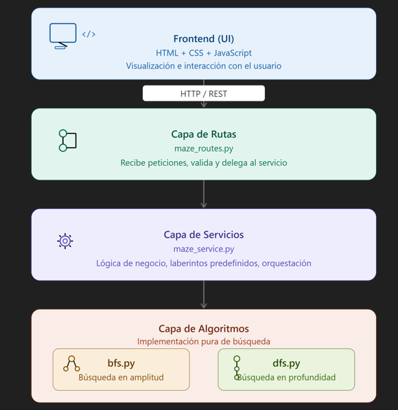

# Manual Técnico — RoboMaze
**Práctica 4 | Inteligencia Artificial 1**  
**Universidad San Carlos de Guatemala — Facultad de Ingeniería**  
**Estudiante:** Johan Cardona | **Carné:** 202201405

---

## 1. Descripción General

RoboMaze es un sistema web para la resolución de laberintos virtuales mediante algoritmos clásicos de búsqueda en inteligencia artificial. Permite visualizar de forma interactiva cómo los algoritmos BFS y DFS exploran un espacio de estados representado como una cuadrícula bidimensional.

---

## 2. Arquitectura del Sistema

El sistema sigue el **patrón de arquitectura por capas**, separando responsabilidades en tres niveles bien definidos:




### Componentes principales

| Componente | Archivo | Responsabilidad |
|------------|---------|----------------|
| Entrada FastAPI | `app/main.py` | Inicialización, CORS, registro de rutas |
| Modelos de datos | `app/models/maze_model.py` | Esquemas Pydantic para request/response |
| Rutas API | `app/routes/maze_routes.py` | Endpoints REST |
| Servicio | `app/services/maze_service.py` | Lógica de negocio y laberintos predefinidos |
| BFS | `app/algorithms/bfs.py` | Algoritmo Breadth-First Search |
| DFS | `app/algorithms/dfs.py` | Algoritmo Depth-First Search |
| Frontend API | `frontend/js/api.js` | Llamadas HTTP al backend |
| Cuadrícula | `frontend/js/maze.js` | Estado y renderizado del laberinto |
| Controlador | `frontend/js/app.js` | Eventos y lógica de la interfaz |

---

## 3. Estructura del Proyecto

```
Practica4/
├── backend/
│   ├── requirements.txt
│   └── app/
│       ├── main.py
│       ├── models/
│       │   └── maze_model.py
│       ├── algorithms/
│       │   ├── bfs.py
│       │   └── dfs.py
│       ├── services/
│       │   └── maze_service.py
│       └── routes/
│           └── maze_routes.py
├── frontend/
│   ├── index.html
│   ├── css/
│   │   └── styles.css
│   └── js/
│       ├── api.js
│       ├── maze.js
│       └── app.js
└── docs/
    ├── manual_tecnico.md
    └── manual_usuario.md
```

---

## 4. Algoritmos Implementados

### 4.1 Breadth-First Search (BFS)

**Principio:** Explora el grafo nivel por nivel utilizando una cola FIFO. Garantiza encontrar el camino más corto en grafos no ponderados.

**Estructura de datos:** `collections.deque` (cola de doble extremo)

**Pseudocódigo:**
```
BFS(grid, inicio, destino):
  cola ← [inicio]
  visitados ← {inicio}
  padres ← {inicio: None}

  mientras cola no esté vacía:
    actual ← cola.popleft()
    si actual == destino → reconstruir ruta y retornar

    para cada vecino de actual (arriba, abajo, izq, der):
      si vecino es válido y no visitado:
        visitados.agregar(vecino)
        padres[vecino] ← actual
        cola.agregar(vecino)

  retornar sin ruta encontrada
```

**Complejidad:**
- Tiempo: O(V + E) donde V = vértices, E = aristas
- Espacio: O(V)

**Garantía:** Siempre encuentra la ruta más corta si existe.

---

### 4.2 Depth-First Search (DFS)

**Principio:** Explora tan profundo como sea posible antes de retroceder, utilizando una pila LIFO.

**Estructura de datos:** Lista de Python usada como pila (`append` / `pop`)

**Pseudocódigo:**
```
DFS(grid, inicio, destino):
  pila ← [inicio]
  visitados ← {inicio}
  padres ← {inicio: None}

  mientras pila no esté vacía:
    actual ← pila.pop()
    si actual == destino → reconstruir ruta y retornar

    para cada vecino de actual (arriba, abajo, izq, der):
      si vecino es válido y no visitado:
        visitados.agregar(vecino)
        padres[vecino] ← actual
        pila.agregar(vecino)

  retornar sin ruta encontrada
```

**Complejidad:**
- Tiempo: O(V + E)
- Espacio: O(V)

**Limitación:** No garantiza la ruta más corta.

---

### 4.3 Representación del laberinto

El laberinto se representa como una matriz 2D de enteros:

| Valor | Significado |
|-------|-------------|
| `0` | Celda libre (transitable) |
| `1` | Obstáculo (bloqueado) |

Las posiciones se expresan como `[fila, columna]` con índice base 0. Los movimientos válidos son: arriba, abajo, izquierda y derecha (sin diagonales).

---

## 5. API REST

### Base URL
```
http://localhost:8000/api
```

### Endpoints

#### `POST /api/search`
Ejecuta un algoritmo de búsqueda sobre el laberinto enviado.

**Request Body:**
```json
{
  "grid": [[0, 0, 1], [0, 0, 0], [1, 0, 0]],
  "start": [0, 0],
  "end": [2, 2],
  "algorithm": "bfs"
}
```

**Response:**
```json
{
  "found": true,
  "path": [[0,0], [1,0], [1,1], [1,2], [2,2]],
  "explored": [[0,0], [1,0], [0,1], [1,1], [1,2], [2,2]],
  "path_length": 5,
  "nodes_explored": 6,
  "execution_time": 0.0412,
  "message": "Ruta encontrada con BFS."
}
```

#### `GET /api/mazes`
Retorna todos los laberintos predefinidos.

#### `GET /api/mazes/{id}`
Retorna un laberinto predefinido por ID. Retorna HTTP 404 si no existe.

---

## 6. Modelos de Datos

### MazeRequest
| Campo | Tipo | Descripción |
|-------|------|-------------|
| `grid` | `List[List[int]]` | Matriz 2D del laberinto |
| `start` | `List[int]` | Posición inicio `[fila, col]` |
| `end` | `List[int]` | Posición destino `[fila, col]` |
| `algorithm` | `str` | `"bfs"` o `"dfs"` |

### MazeResponse
| Campo | Tipo | Descripción |
|-------|------|-------------|
| `found` | `bool` | Si se encontró ruta |
| `path` | `List[List[int]]` | Celdas de la ruta |
| `explored` | `List[List[int]]` | Celdas exploradas |
| `path_length` | `int` | Longitud de la ruta |
| `nodes_explored` | `int` | Total de nodos visitados |
| `execution_time` | `float` | Tiempo en milisegundos |
| `message` | `str` | Mensaje descriptivo |

---

## 7. Requerimientos Funcionales

| ID | Descripción |
|----|-------------|
| RF-01 | El sistema debe representar un laberinto como cuadrícula 2D |
| RF-02 | El usuario puede definir obstáculos en la cuadrícula |
| RF-03 | El usuario puede definir un punto de inicio y un punto de destino |
| RF-04 | El sistema debe ejecutar el algoritmo BFS sobre el laberinto |
| RF-05 | El sistema debe ejecutar el algoritmo DFS sobre el laberinto |
| RF-06 | El sistema debe mostrar visualmente las celdas exploradas |
| RF-07 | El sistema debe mostrar visualmente la ruta encontrada |
| RF-08 | El sistema debe mostrar la cantidad de nodos explorados |
| RF-09 | El sistema debe mostrar el tiempo de ejecución en milisegundos |
| RF-10 | El sistema debe comparar BFS y DFS en una tabla de métricas |
| RF-11 | El sistema debe informar cuando no existe ruta entre origen y destino |
| RF-12 | El sistema debe proveer al menos 5 laberintos predefinidos |
| RF-13 | El usuario puede redimensionar la cuadrícula (3x3 hasta 15x15) |

---

## 8. Requerimientos No Funcionales

| ID | Categoría | Descripción |
|----|-----------|-------------|
| RNF-01 | Rendimiento | El backend debe responder en menos de 500 ms para laberintos de hasta 15x15 |
| RNF-02 | Usabilidad | La interfaz debe ser intuitiva y operable sin documentación previa |
| RNF-03 | Mantenibilidad | El código debe seguir el patrón de capas para facilitar modificaciones independientes |
| RNF-04 | Escalabilidad | La arquitectura permite agregar nuevos algoritmos sin modificar rutas ni frontend |
| RNF-05 | Portabilidad | El sistema funciona en Windows, Linux y macOS con Python 3.11+ |
| RNF-06 | Seguridad | El backend valida el algoritmo solicitado antes de ejecutar |
| RNF-07 | Disponibilidad | El sistema no depende de bases de datos ni servicios externos |

---

## 9. Tecnologías Utilizadas

| Tecnología | Versión | Uso |
|------------|---------|-----|
| Python | 3.11+ | Lenguaje del backend |
| FastAPI | 0.111.0 | Framework web REST |
| Uvicorn | 0.29.0 | Servidor ASGI |
| Pydantic | 2.7.1 | Validación de modelos de datos |
| HTML5 | — | Estructura del frontend |
| CSS3 | — | Estilos e interfaz visual |
| JavaScript (ES2021) | — | Lógica del frontend |

---

## 10. Posibles Mejoras Futuras

- Implementar el algoritmo A* con heurística Manhattan para comparación adicional.
- Agregar animación paso a paso configurable (velocidad ajustable).
- Permitir guardar y cargar laberintos en formato JSON.
- Generación automática de laberintos con algoritmos como Recursive Backtracker.
- Exportar resultados de comparación a CSV.
- Agregar soporte para movimientos diagonales.
