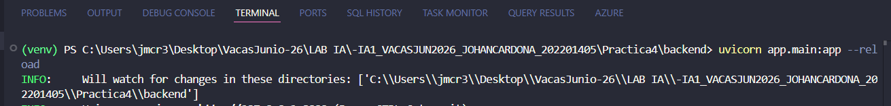
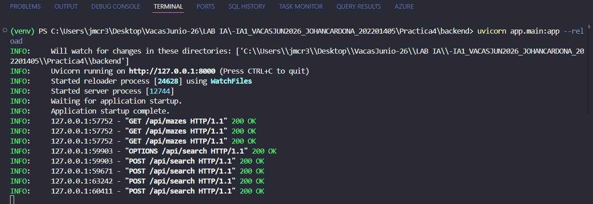
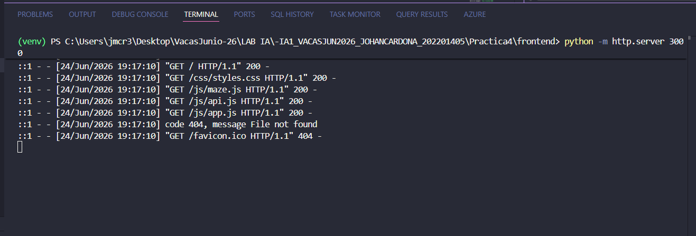
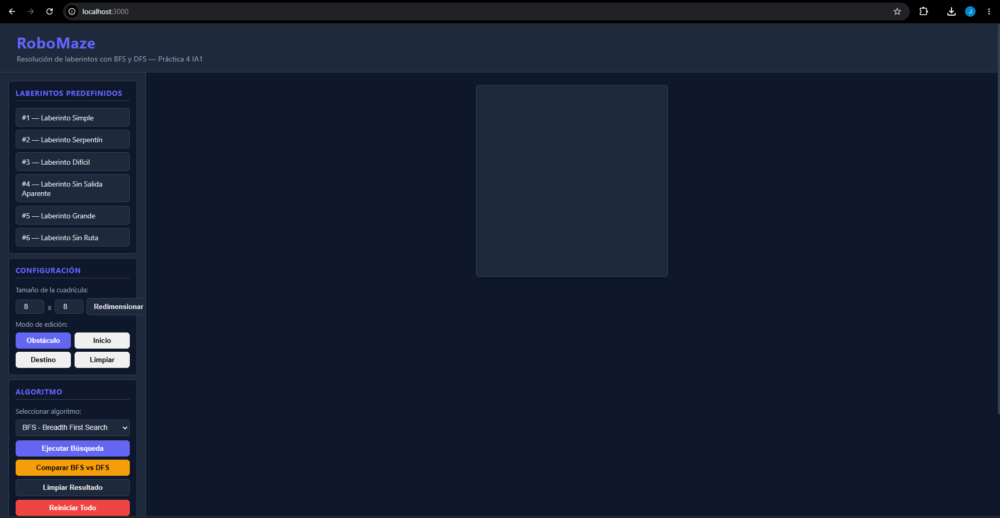
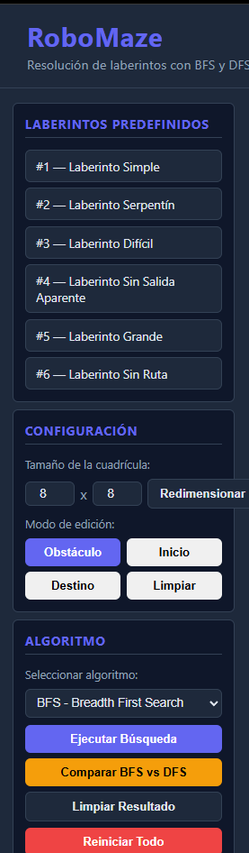
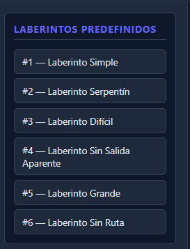
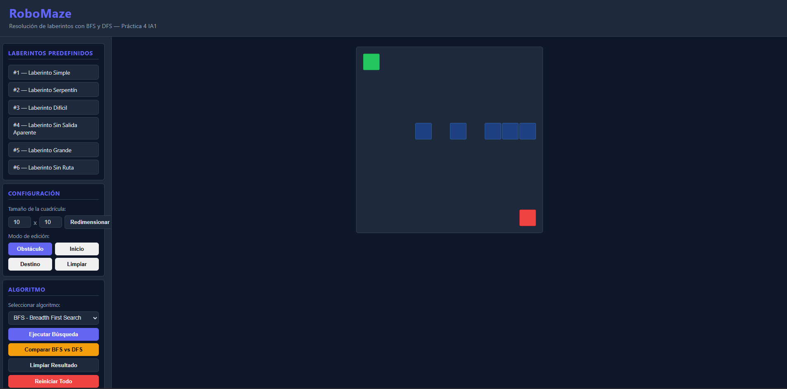
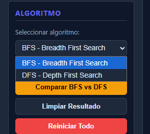
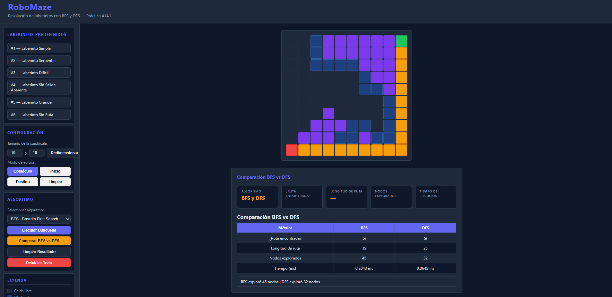

# Manual de Usuario — RoboMaze
**Práctica 4 | Inteligencia Artificial 1**  
**Universidad San Carlos de Guatemala — Facultad de Ingeniería**

---

## 1. Requisitos Previos

Antes de ejecutar el sistema, asegúrate de tener instalado:

- **Python 3.11 o superior** — [python.org](https://www.python.org/downloads/)
- **Navegador web actualizado** (Chrome, Firefox, Edge)
- **Git** (opcional, para clonar el repositorio)

---

## 2. Instalación

### Paso 1 — Clonar o descargar el repositorio

```bash
git clone <URL_DEL_REPOSITORIO>
cd Practica4
```

### Paso 2 — Crear entorno virtual (recomendado)

```bash
python -m venv venv

# Windows
venv\Scripts\activate



### Paso 3 — Instalar dependencias del backend

```bash
cd backend
pip install -r requirements.txt
```

---

## 3. Ejecución del Sistema

El sistema tiene dos partes que deben correr al mismo tiempo: el **backend** y el **frontend**.

### Iniciar el Backend

Desde la carpeta `backend/`:

```bash
uvicorn app.main:app --reload
```



El servidor estará disponible en: `http://localhost:8000`  
La documentación automática de la API en: `http://localhost:8000/docs`

### Iniciar el Frontend

Desde la carpeta `frontend/`:

```bash
python -m http.server 3000
```




Abre el navegador en: `http://localhost:3000`

---

## 4. Descripción de la Interfaz



La interfaz está dividida en dos áreas principales:

### Panel lateral izquierdo
Contiene todos los controles de la aplicación organizados en secciones.



### Área central
Muestra la cuadrícula del laberinto y los resultados de la búsqueda.

---

## 5. Uso del Sistema

### 5.1 Cargar un laberinto predefinido

1. En la sección **"Laberintos Predefinidos"** del panel izquierdo, verás una lista con los laberintos disponibles.
2. Haz clic en cualquiera de ellos para cargarlo automáticamente en la cuadrícula.
3. El laberinto aparecerá con su inicio (verde) y destino (rojo) ya configurados.

**Laberintos disponibles:**

| # | Nombre | Descripción |
|---|--------|-------------|
| 1 | Laberinto Simple | Cuadrícula 5x5 con ruta directa |
| 2 | Laberinto Serpentín | Ruta en zigzag 7x7 |
| 3 | Laberinto Difícil | Múltiples caminos falsos 8x8 |
| 4 | Laberinto Sin Salida Aparente | Ruta no obvia 6x6 |
| 5 | Laberinto Grande | Cuadrícula compleja 10x10 |
| 6 | Laberinto Sin Ruta | Demostración de camino bloqueado |

---




### 5.2 Crear un laberinto personalizado

#### Configurar el tamaño

1. En la sección **"Configuración"**, ingresa el número de filas y columnas deseado (entre 3 y 15).
2. Haz clic en **"Redimensionar"** para aplicar el cambio.

#### Definir el punto de inicio

1. Haz clic en el botón **"Inicio"** para activar ese modo.
2. Haz clic sobre cualquier celda de la cuadrícula para marcarla en **verde** como punto de inicio.

#### Definir el punto de destino

1. Haz clic en el botón **"Destino"** para activar ese modo.
2. Haz clic sobre cualquier celda para marcarla en **rojo** como punto de destino.

#### Colocar obstáculos

1. Haz clic en el botón **"Obstáculo"** para activar ese modo.
2. Haz clic sobre cualquier celda libre para convertirla en obstáculo (azul oscuro).
3. Haz clic sobre un obstáculo existente para quitarlo.



#### Limpiar una celda

1. Activa el modo **"Limpiar"** y haz clic sobre cualquier celda para devolverla a su estado libre.

---

### 5.3 Ejecutar una búsqueda

1. En la sección **"Algoritmo"**, selecciona **BFS** o **DFS** en el menú desplegable.
2. Haz clic en **"Ejecutar Búsqueda"**.
3. El sistema enviará el laberinto al backend y mostrará:
   - **Celdas moradas:** nodos explorados por el algoritmo.
   - **Celdas amarillas:** ruta final encontrada.

---



### 5.4 Comparar BFS vs DFS

1. Configura el laberinto con inicio y destino.
2. Haz clic en **"Comparar BFS vs DFS"**.
3. Se ejecutarán ambos algoritmos automáticamente.
4. Aparecerá una tabla con las métricas comparativas:

| Métrica | BFS | DFS |
|---------|-----|-----|
| ¿Ruta encontrada? | Sí/No | Sí/No |
| Longitud de ruta | N celdas | N celdas |
| Nodos explorados | N | N |
| Tiempo (ms) | X.XXXX ms | X.XXXX ms |

---



### 5.5 Interpretar los resultados

Debajo de la cuadrícula aparece el panel de resultados con las siguientes métricas:

| Métrica | Descripción |
|---------|-------------|
| **Algoritmo** | BFS o DFS ejecutado |
| **¿Ruta encontrada?** | Sí si existe camino, No si está bloqueado |
| **Longitud de ruta** | Cantidad de celdas en el camino encontrado |
| **Nodos explorados** | Total de celdas visitadas durante la búsqueda |
| **Tiempo de ejecución** | Duración del algoritmo en milisegundos |

Un mensaje en la parte inferior indica si la ruta fue encontrada (borde verde) o si no existe camino (borde rojo).

---

### 5.6 Limpiar y reiniciar

| Botón | Acción |
|-------|--------|
| **Limpiar Resultado** | Elimina la visualización de exploración y ruta, mantiene el laberinto |
| **Reiniciar Todo** | Borra completamente la cuadrícula y empieza desde cero |

---

## 6. Leyenda de Colores

| Color | Significado |
|-------|-------------|
| Azul oscuro (sin relleno) | Celda libre |
| Azul medio | Obstáculo |
| Verde | Punto de inicio |
| Rojo | Punto de destino |
| Morado | Celda explorada por el algoritmo |
| Amarillo/naranja | Celda parte de la ruta final |

---

## 7. Verificar que el Backend está funcionando

Abre en el navegador: `http://localhost:8000`

Deberías ver:
```json
{"message": "RoboMaze API activa", "docs": "/docs"}
```

Para ver y probar todos los endpoints disponibles visita: `http://localhost:8000/docs`

---

## 8. Solución de Problemas Comunes

| Problema | Causa probable | Solución |
|----------|---------------|----------|
| La cuadrícula no aparece | Backend no está corriendo | Inicia `uvicorn app.main:app --reload` |
| "Error al conectar con el backend" | Puerto 8000 no disponible | Verifica que el servidor esté activo |
| Los laberintos predefinidos no cargan | Backend apagado | Reinicia el servidor |
| El tiempo muestra 0.0000 ms | Reiniciar el servidor con los cambios | Detén y vuelve a iniciar uvicorn |
| Abrí index.html directo y no funciona | CORS bloqueado por `file://` | Usa `python -m http.server 3000` |
