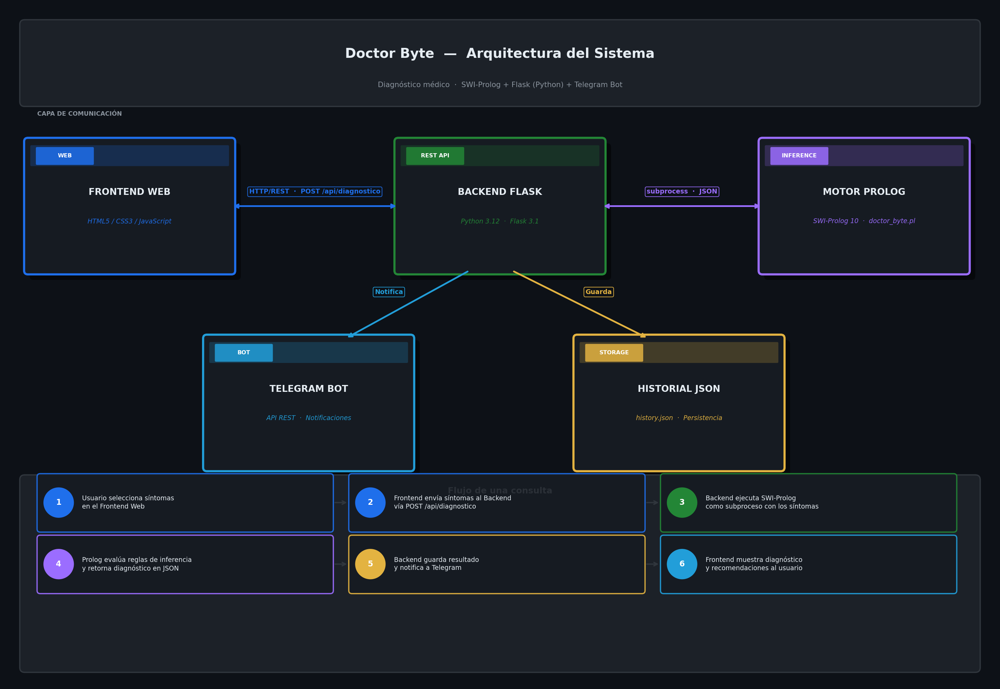

# Documento Tecnico - Doctor Byte
## Sistema Experto para Diagnostico de Fallas en Computadoras
**Universidad San Carlos de Guatemala - Facultad de Ingenieria**
**Inteligencia Artificial 1 - Vacaciones Primer Semestre 2026**
**Estudiante:** Johan Cardona - 202201405

---

## 1. Introduccion

Doctor Byte es un sistema experto orientado al diagnostico automatico de fallas comunes en computadoras. El sistema permite que un usuario seleccione sintomas observados en su equipo y recibe como respuesta un diagnostico preliminar junto con recomendaciones especificas para resolver el problema identificado.

El sistema simula el razonamiento de un tecnico especializado mediante reglas de inferencia implementadas en Prolog, integrando una interfaz web moderna y un bot de Telegram para la notificacion de resultados.

---

## 2. Arquitectura del Sistema

El sistema esta compuesto por cuatro capas principales que se comunican entre si:




### Flujo de una consulta

1. El usuario selecciona sintomas en el frontend web.
2. El frontend envia los sintomas al backend via POST /api/diagnostico.
3. El backend ejecuta SWI-Prolog como subproceso, pasando los sintomas como parametro.
4. Prolog evalua las reglas de inferencia y retorna el diagnostico en formato JSON.
5. El backend guarda el resultado en el historial (JSON) y notifica a Telegram.
6. El frontend muestra el diagnostico y las recomendaciones al usuario.

---

## 3. Tecnologias Utilizadas

| Tecnologia | Version | Proposito |
|---|---|---|
| SWI-Prolog | 10.0.2 | Motor de inferencia y base de conocimiento |
| Python | 3.12.5 | Lenguaje del backend |
| Flask | 3.1.1 | Framework web para la API REST |
| Flask-CORS | 5.0.1 | Manejo de peticiones cross-origin |
| python-dotenv | 1.1.0 | Gestion de variables de entorno |
| requests | 2.32.3 | Comunicacion con la API de Telegram |
| HTML5/CSS3/JS | - | Interfaz de usuario |
| Telegram Bot API | - | Notificaciones de diagnosticos |
| Git/GitHub | - | Control de versiones |

---

## 4. Estructura del Proyecto


---

## 5. Base de Conocimiento en Prolog

### 5.1 Sintomas implementados (18)

| ID | Descripcion |
|---|---|
| pantalla_negra | La pantalla no muestra imagen al encender |
| reinicio_inesperado | El equipo se reinicia solo sin razon aparente |
| lentitud_sistema | El sistema responde muy lento |
| sobrecalentamiento | El equipo se calienta demasiado al usarlo |
| ruido_disco | Se escuchan ruidos mecanicos desde el disco duro |
| no_arranca | El sistema operativo no carga correctamente |
| pantalla_azul | Aparece pantalla azul con codigo de error (BSOD) |
| no_reconoce_dispositivos | Los USB u otros perifericos no son detectados |
| errores_memoria | Aparecen mensajes de error relacionados con la RAM |
| ventilador_ruidoso | El ventilador hace ruido excesivo o inusual |
| bateria_no_carga | La bateria no aumenta su carga aunque este conectada |
| wifi_no_conecta | No es posible conectarse a redes inalambricas |
| aplicaciones_cierran_solas | Los programas se cierran solos de manera inesperada |
| teclado_no_funciona | Algunas teclas o todo el teclado no responde |
| imagen_distorsionada | La imagen en pantalla aparece con artefactos o distorsion |
| no_enciende | El equipo no da ninguna senal de vida al presionar el boton |
| archivos_corruptos | Archivos se corrumpen o desaparecen sin razon |
| actualizaciones_fallan | Las actualizaciones del sistema fallan o no se instalan |

### 5.2 Fallas diagnosticables (11)

1. fallo_disco_duro
2. fallo_ram
3. sobrecalentamiento_cpu
4. fallo_tarjeta_grafica
5. infeccion_malware
6. fallo_sistema_operativo
7. fallo_fuente_poder
8. fallo_bateria
9. fallo_red
10. fallo_teclado
11. fallo_controladores

### 5.3 Reglas de inferencia principales

Las reglas combinadas (mayor precision) tienen prioridad sobre las reglas de sintoma unico. Prolog evalua las clausulas en orden de aparicion.

**Ejemplos de reglas combinadas:**
- ruido_disco + archivos_corruptos => fallo_disco_duro
- pantalla_azul + errores_memoria => fallo_ram
- sobrecalentamiento + ventilador_ruidoso + reinicio_inesperado => sobrecalentamiento_cpu
- lentitud_sistema + aplicaciones_cierran_solas + actualizaciones_fallan => infeccion_malware

**Uso del corte (!):**
El operador de corte se utiliza en el predicado `eliminar_duplicados/3` para detener la busqueda una vez que se detecta que una falla ya fue incluida en el resultado, evitando diagnosticos repetidos cuando multiples reglas apuntan a la misma falla.

### 5.4 Comunicacion Python-Prolog

Python ejecuta SWI-Prolog como subproceso usando el modulo `subprocess`. El goal de Prolog imprime el resultado en formato JSON al stdout, que Python captura y parsea:

```python
cmd = ["swipl", "--quiet", "-g", f"consult('archivo.pl'),{goal},halt", "-t", "halt(1)"]
resultado = subprocess.run(cmd, capture_output=True, text=True)
datos = json.loads(resultado.stdout)
```

---

## 6. API REST

| Metodo | Endpoint | Descripcion |
|---|---|---|
| GET | /api/sintomas | Retorna todos los sintomas disponibles |
| POST | /api/diagnostico | Recibe sintomas y retorna diagnostico |
| GET | /api/historial | Retorna todos los diagnosticos realizados |
| GET | /api/historial/<id> | Retorna un diagnostico especifico por ID |

### Ejemplo de request POST /api/diagnostico

```json
{
  "sintomas": ["ruido_disco", "archivos_corruptos"]
}
```

### Ejemplo de response

```json
{
  "ok": true,
  "id": "6ed7e6f4-bf20-49ac-8ee2-c57e03286fd7",
  "timestamp": "2026-06-11T00:01:12.632861",
  "sintomas": ["ruido_disco", "archivos_corruptos"],
  "diagnosticos": [
    {
      "falla": "fallo_disco_duro",
      "descripcion": "Fallo en el disco duro: el almacenamiento presenta danos fisicos o logicos",
      "recomendaciones": [
        "Realizar respaldo inmediato de los datos mas importantes",
        "Ejecutar CHKDSK o similar para verificar sectores danados",
        "Reemplazar el disco duro por uno nuevo (HDD o SSD)",
        "Considerar instalacion en SSD para mejor rendimiento"
      ]
    }
  ]
}
```

---

## 7. Historial de Diagnosticos

Los diagnosticos se almacenan de forma persistente en `backend/data/history.json`. Cada entrada contiene un ID unico (UUID), timestamp, lista de sintomas usados y lista de diagnosticos obtenidos. El historial se puede consultar desde la interfaz web en la seccion "Historial".

---

## 8. Integracion con Telegram

El sistema utiliza la API HTTP de Telegram para enviar notificaciones. Cada vez que se realiza un diagnostico, el backend construye un mensaje HTML con los sintomas reportados, las fallas detectadas y las recomendaciones, y lo envia al chat configurado mediante el endpoint `sendMessage` de la API.

La integracion es no bloqueante: si el envio falla, el sistema responde igualmente al usuario sin interrupciones.

---

## 9. Instalacion y Ejecucion

### Requisitos previos
- Python 3.10 o superior
- SWI-Prolog 9.0 o superior
- Cuenta de Telegram y bot creado via @BotFather

### Pasos

```bash
# 1. Clonar el repositorio
git clone <url-del-repositorio>

# 2. Instalar dependencias de Python
cd Proyecto1/backend
pip install -r requirements.txt

# 3. Configurar variables de entorno
cp .env.example .env
# Editar .env con el token del bot y el chat ID

# 4. Ejecutar el servidor
python app.py

# 5. Abrir en el navegador
# http://localhost:5000
```
