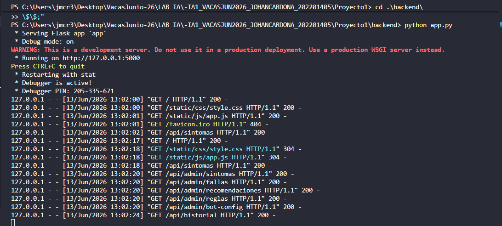
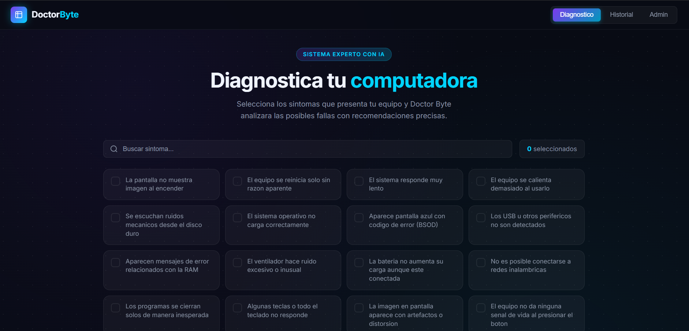
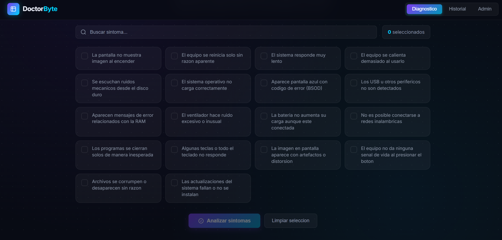
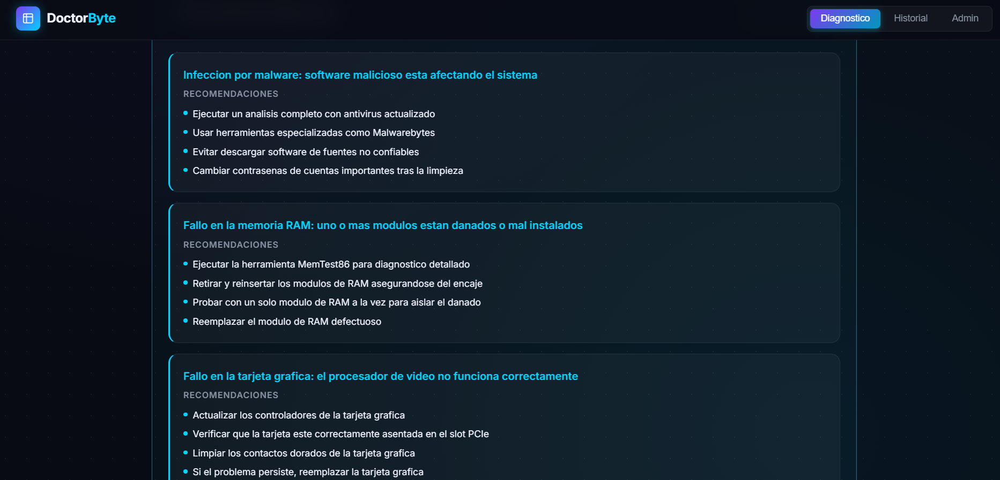
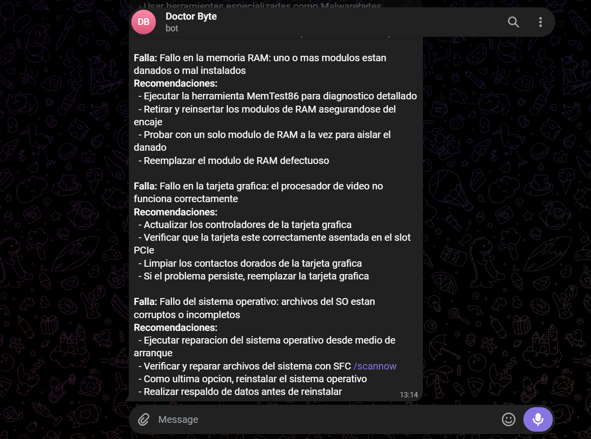
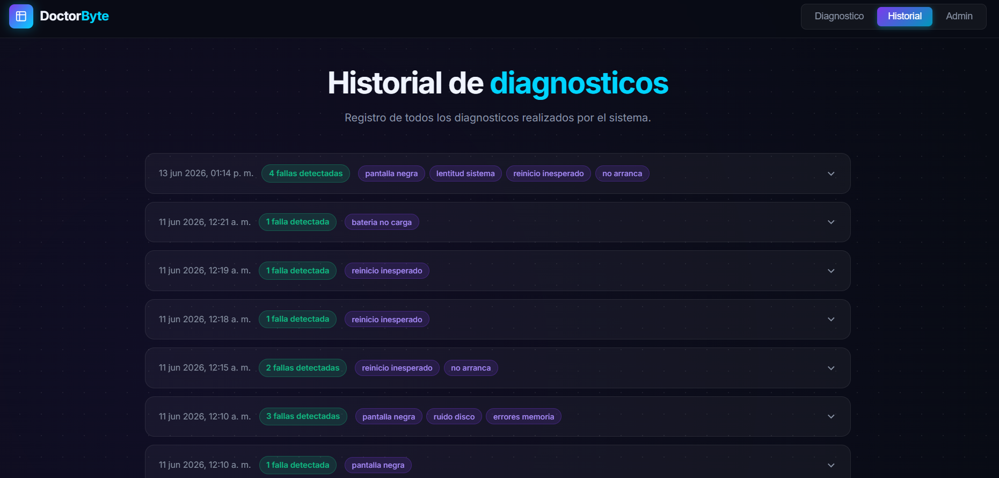

# Manual de Usuario - Doctor Byte
## Sistema Experto para Diagnostico de Fallas en Computadoras

---

## 1. Introduccion

Doctor Byte es una herramienta web que te ayuda a identificar que falla tiene tu computadora. Solo debes seleccionar los sintomas que observas y el sistema te dira que problema tiene tu equipo y como solucionarlo.

---

## 2. Requisitos para ejecutar el sistema

| Requisito | Detalle |
|---|---|
| Sistema operativo | Windows 10/11, Linux o macOS |
| Python | Version 3.10 o superior |
| SWI-Prolog | Version 9.0 o superior |
| Navegador web | Chrome, Edge o Firefox actualizados |
| Conexion a internet | Solo para las notificaciones de Telegram |

---

## 3. Instalacion

### Paso 1: Instalar SWI-Prolog
Descarga e instala SWI-Prolog desde https://www.swi-prolog.org
Asegurate de marcarlo como disponible en el PATH del sistema durante la instalacion.

### Paso 2: Instalar dependencias de Python
Abre una terminal en la carpeta `Proyecto1/backend` y ejecuta:
```
pip install -r requirements.txt
```

### Paso 3: Configurar el archivo .env
Dentro de la carpeta `backend`, crea un archivo llamado `.env` con el siguiente contenido:
```
TELEGRAM_BOT_TOKEN=TOKEN
TELEGRAM_CHAT_ID=ID
FLASK_PORT=5000
FLASK_DEBUG=True
```

### Paso 4: Iniciar el sistema
Desde la carpeta `backend`, ejecuta:
```
python app.py
```

Cuando veas el mensaje `Running on http://127.0.0.1:5000`, el sistema esta listo.



### Paso 5: Abrir la aplicacion
Abre tu navegador y visita:
```
http://localhost:5000
```



---

## 4. Como usar el sistema

### 4.1 Pantalla principal - Diagnostico

Al abrir la aplicacion veras la pantalla de diagnostico con los siguientes elementos:

**Buscador de sintomas**
En la parte superior hay un campo de busqueda. Escribe una palabra clave para filtrar los sintomas mostrados. Por ejemplo, escribe "pantalla" para ver solo sintomas relacionados con la pantalla.



**Tarjetas de sintomas**
Debajo del buscador aparece una cuadricula con todos los sintomas disponibles. Cada sintoma es una tarjeta que puedes hacer clic para seleccionarla. Las tarjetas seleccionadas se iluminan en azul con un checkmark.



**Contador de seleccion**
Junto al buscador aparece un contador que muestra cuantos sintomas tienes seleccionados actualmente.

**Boton "Analizar sintomas"**
Una vez seleccionado al menos un sintoma, este boton se activa. Haciendo clic en el se enviaran los sintomas al sistema para obtener el diagnostico.


**Boton "Limpiar seleccion"**
Deselecciona todos los sintomas y oculta el panel de resultados.


### 4.2 Como hacer un diagnostico

1. Observa que sintomas presenta tu computadora.
2. Busca y selecciona esos sintomas en las tarjetas (puedes seleccionar varios).
3. Haz clic en el boton "Analizar sintomas".
4. Espera unos segundos mientras el sistema analiza.
5. Lee el resultado en el panel que aparece debajo.

**Consejo:** Mientras mas sintomas selecciones que correspondan a tu problema, mas preciso sera el diagnostico. Pero con un solo sintoma ya obtienes un resultado inicial.

### 4.3 Interpretar el resultado

El panel de resultado muestra:
- **Nombre de la falla detectada** en azul (puede haber mas de una).
- **Lista de recomendaciones** para resolver la falla.
- **Fecha y hora** del diagnostico en la esquina superior derecha.

Si el sistema no encuentra diagnostico, te indicara que intentes agregar mas sintomas.

### 4.4 Notificacion en Telegram

Si el sistema tiene un bot de Telegram configurado, recibiras automaticamente un mensaje en Telegram con el resultado del diagnostico cada vez que hagas un analisis. No necesitas hacer nada adicional.


---

## 5. Historial de diagnosticos

Haz clic en el boton "Historial" en la barra de navegacion superior para ver todos los diagnosticos realizados anteriormente.

Cada entrada del historial muestra:
- Fecha y hora del diagnostico.
- Badge de color: verde si se encontro una falla, amarillo si no hubo resultado.
- Los sintomas que se usaron (en etiquetas moradas).

Haz clic en cualquier entrada para expandirla y ver los diagnosticos completos con sus recomendaciones.



---

## 6. Referencia de sintomas

| Sintoma | Cuando seleccionarlo |
|---|---|
| Pantalla negra | La pantalla no muestra nada al encender |
| Reinicio inesperado | El equipo se apaga y reinicia solo |
| Lentitud del sistema | Todo tarda demasiado en responder |
| Sobrecalentamiento | El equipo esta muy caliente al tacto |
| Ruido en el disco | Se escuchan chasquidos o chirridos del disco |
| No arranca | Windows/Linux no carga, se queda en pantalla negra o de carga |
| Pantalla azul (BSOD) | Aparece una pantalla azul con texto de error |
| No reconoce dispositivos | Los USB, impresoras u otros perifericos no funcionan |
| Errores de memoria | Aparecen mensajes que mencionan RAM o memoria |
| Ventilador ruidoso | El ventilador suena demasiado fuerte o de forma extraña |
| Bateria no carga | Conectas el cargador pero la bateria no sube |
| WiFi no conecta | No puedes conectarte a redes inalambricas |
| Aplicaciones cierran solas | Los programas se cierran solos sin dar error |
| Teclado no funciona | Algunas teclas o todo el teclado no responde |
| Imagen distorsionada | La pantalla muestra colores raros, lineas o pixeles |
| No enciende | El equipo no da ninguna senal al presionar el boton |
| Archivos corruptos | Archivos se danan o desaparecen solos |
| Actualizaciones fallan | Las actualizaciones de Windows o del sistema no se instalan |

---

## 7. Soluciones a problemas comunes

**El sistema no abre en el navegador**
Verifica que el servidor este corriendo (debe mostrar "Running on http://127.0.0.1:5000" en la terminal) y que estes ingresando exactamente `http://localhost:5000`.

**Los sintomas no cargan**
Revisa que el servidor Flask este activo. Si muestra un error en la terminal, reinicia con `python app.py`.

**No llega la notificacion de Telegram**
Verifica que hayas enviado al menos un mensaje a tu bot antes de configurarlo. Revisa que el token y el chat ID en el archivo `.env` sean correctos y que el servidor haya sido reiniciado despues de cambiarlos.

**El diagnostico tarda mucho**
Es normal que tome entre 2 y 5 segundos porque el sistema ejecuta SWI-Prolog en cada consulta. Si tarda mas de 15 segundos, reinicia el servidor.
